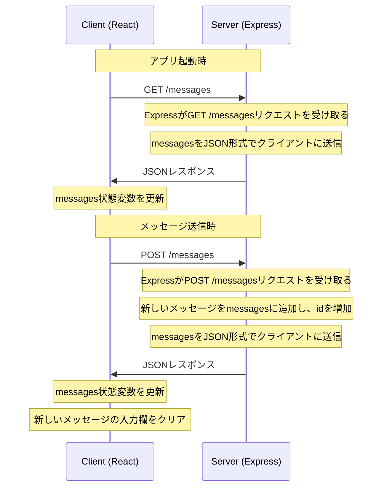
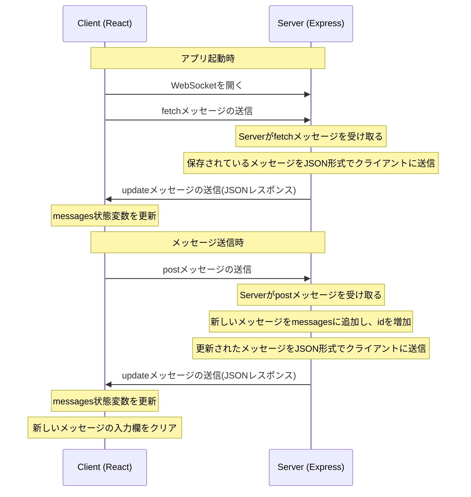

# 同期チャットと非同期チャット

## はじめに

このリポジトリは、WebSocketを使用した同期（リアルタイム）チャット と HTTPを使用した非同期チャットを比較するために作られています。

`websocket_sample` が同期チャット、`http_sample` が非同期チャットのサンプルコードです。

## 環境

**使用技術とバージョン**

| 技術 | バージョン |
| --- | --- |
| Node.js | v18.12.1 |
| React | 18.2.0 |
| Express | 4.18.2 |

## シーケンス図

- **http_sample**

1. **アプリ起動時**：クライアントは起動時にサーバーにGETリクエストを送ります。このリクエストはサーバー上に保存されているメッセージを取得するためのものです。

2. **GET /messages**：クライアントからのGETリクエストを受け取ったサーバーは、保存しているメッセージをJSON形式に変換してクライアントに返します。

3. **JSONレスポンス**：クライアントはJSON形式のレスポンスを受け取り、これをパースして状態変数`messages`を更新します。この`messages`はクライアントが描画するメッセージのリストを表しています。

4. **メッセージ送信時**：ユーザーが新しいメッセージを送信しようとすると、クライアントはPOSTリクエストをサーバーに送ります。このリクエストは新たなメッセージをサーバーに送信するためのものです。

5. **POST /messages**：サーバーはクライアントからのPOSTリクエストを受け取り、新しいメッセージを保存するための配列`messages`に追加します。また、新しいメッセージに一意なIDを割り当てるために、IDを増加させます。

6. **JSONレスポンス**：その後、サーバーは更新されたメッセージリストをJSON形式に変換してクライアントに返します。

7. **messages状態変数の更新と新しいメッセージの入力欄のクリア**：クライアントは再度JSONレスポンスをパースして状態変数`messages`を更新し、新たなメッセージが描画されます。そして、新しいメッセージの入力欄はクリアされます。

- **websocket_sample**

1. **アプリ起動時**：最初にクライアントはアプリの起動時にサーバーへWebSocket接続を開く要求をします。その後、「fetchメッセージ」をサーバーに送信します。このメッセージは、サーバー上に保存されているすべてのメッセージをクライアントに送信するよう要求するものです。

2. **fetchメッセージの送信**：サーバーはクライアントからのfetchメッセージを受け取り、保存しているメッセージをJSON形式に変換してクライアントに送信します。（updateメッセージ）

3. **updateメッセージの送信(JSONレスポンス)**：クライアントはこのupdateメッセージを受け取り、そのデータをパースして状態変数`messages`を更新します。これにより、すべてのメッセージがクライアント上で描画されます。

4. **メッセージ送信時**：ユーザーが新しいメッセージを送信しようとすると、クライアントは「postメッセージ」をサーバーに送ります。このメッセージには新たに送信されるメッセージの内容が含まれています。

5. **postメッセージの送信**：サーバーはクライアントからのpostメッセージを受け取り、新しいメッセージを保存するための配列`messages`に追加します。また、新しいメッセージに一意なIDを割り当てるために、IDを増加させます。

6. **updateメッセージの送信(JSONレスポンス)**：その後、サーバーは更新されたメッセージリストを再びJSON形式に変換してクライアントに送信します。（updateメッセージ）

7. **messages状態変数の更新と新しいメッセージの入力欄のクリア**：クライアントは再度updateメッセージをパースして状態変数`messages`を更新し、新たなメッセージが描画されます。そして、新しいメッセージの入力欄はクリアされます。

